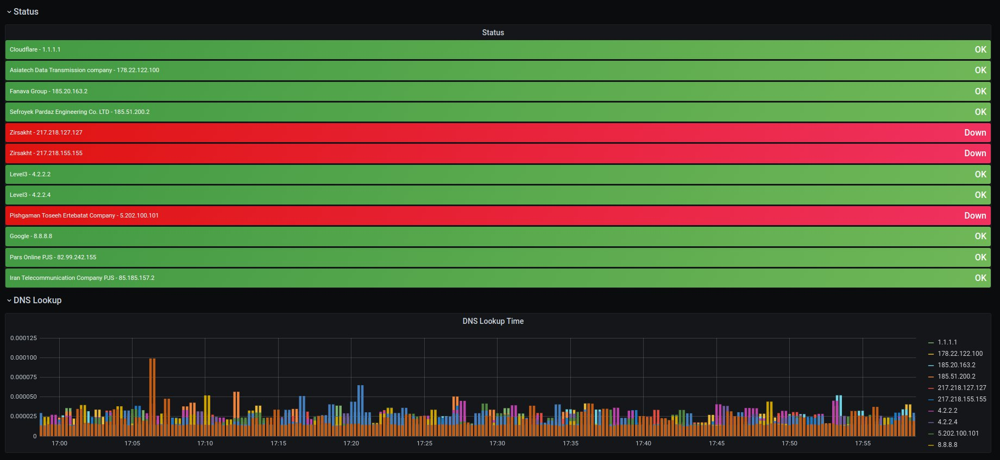

# Example of BlackBox Exporter Config - DNS Module 



blackbox.conf 

```
config:
  modules:
    dns:
      prober: dns
      dns:
        query_name: "www.example.com"
        query_type: "A"

```

Prometheus Scrape Config - Kubernetes Env

```
     - job_name: 'dns-uptime'
       metrics_path: /probe
       params:
         module: [dns]
       static_configs:
         - targets:
           - 8.8.8.8
           labels:
             server: 'Google'
         - targets:
           - 4.2.2.2
           - 4.2.2.4
           labels:
             server: 'Level3'
         - targets:
           - 1.1.1.1
           labels:
             server: 'Cloudflare'
         - targets:
           - 217.218.155.155
           - 217.218.127.127
           labels:
             server: 'Zirsakht'
         - targets:
           - 85.185.157.2
           labels:
             server: 'Iran Telecommunication Company PJS'
         - targets:
           - 178.22.122.100
           labels:
             server: 'Asiatech Data Transmission company'
         - targets:
           - 185.20.163.2
           labels:
             server: 'Fanava Group'
         - targets:
           - 185.51.200.2
           labels:
             server: 'Sefroyek Pardaz Engineering Co. LTD'
         - targets:
           - 5.202.100.101
           labels:
             server: 'Pishgaman Toseeh Ertebatat Company'
         - targets:
           - 82.99.242.155
           labels:
             server: 'Pars Online PJS'
       relabel_configs:
         - source_labels: [__address__]
           target_label: __param_target
         - source_labels: [__param_target]
           target_label: instance
         - target_label: __address__
           replacement: blackbox-exporter:9115
```

Useful Links 

Prometheus Blackbox Exporter Helm Chart
https://github.com/helm/charts/tree/master/stable/prometheus-blackbox-exporter
